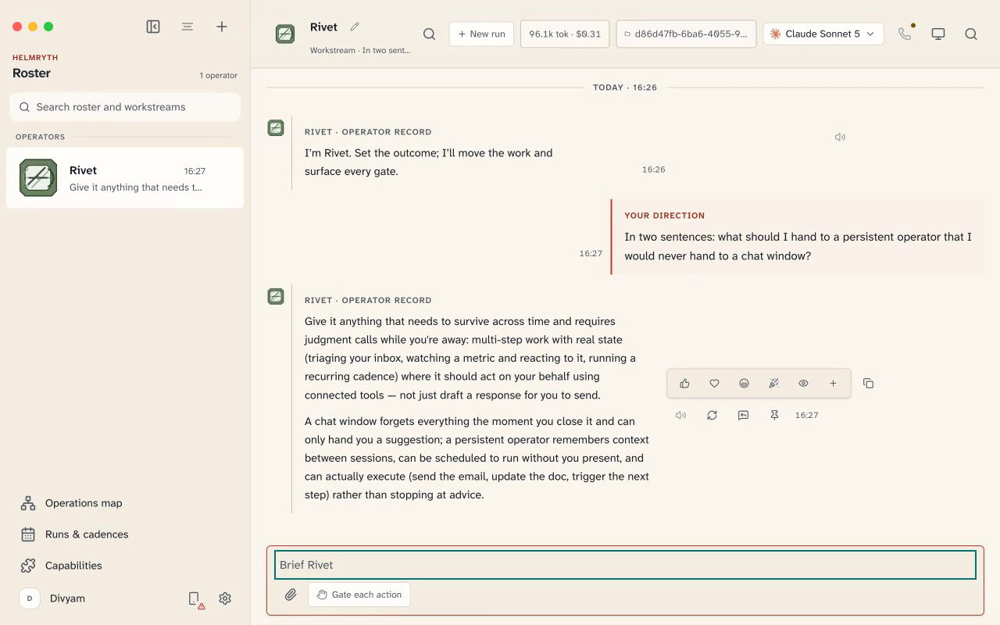
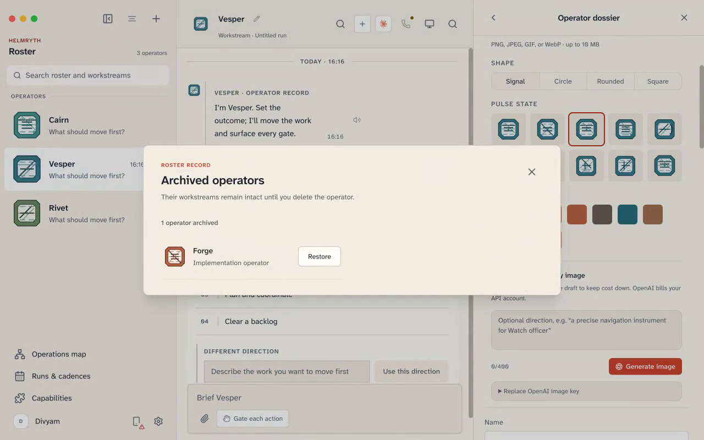
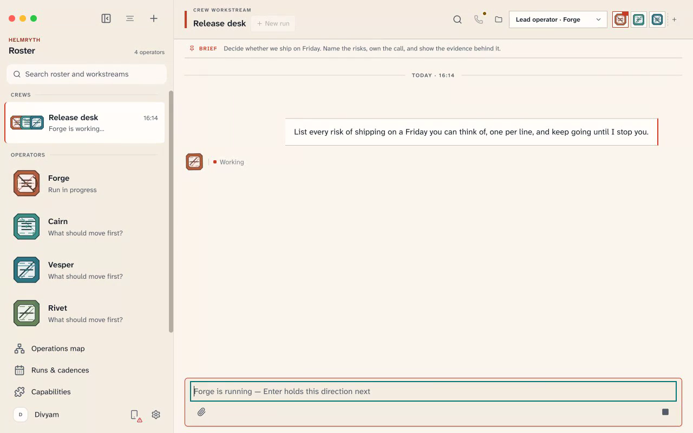
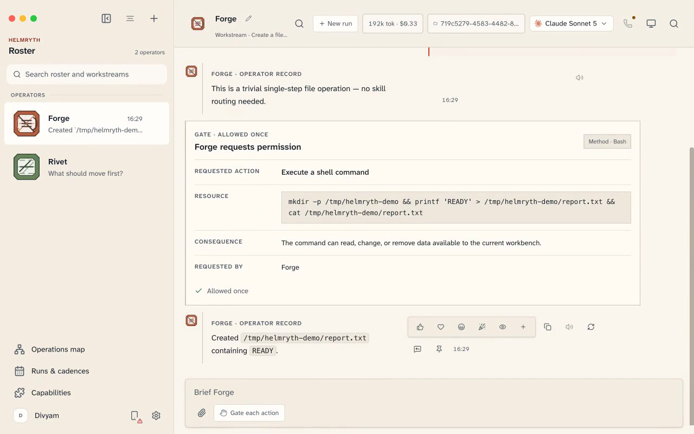
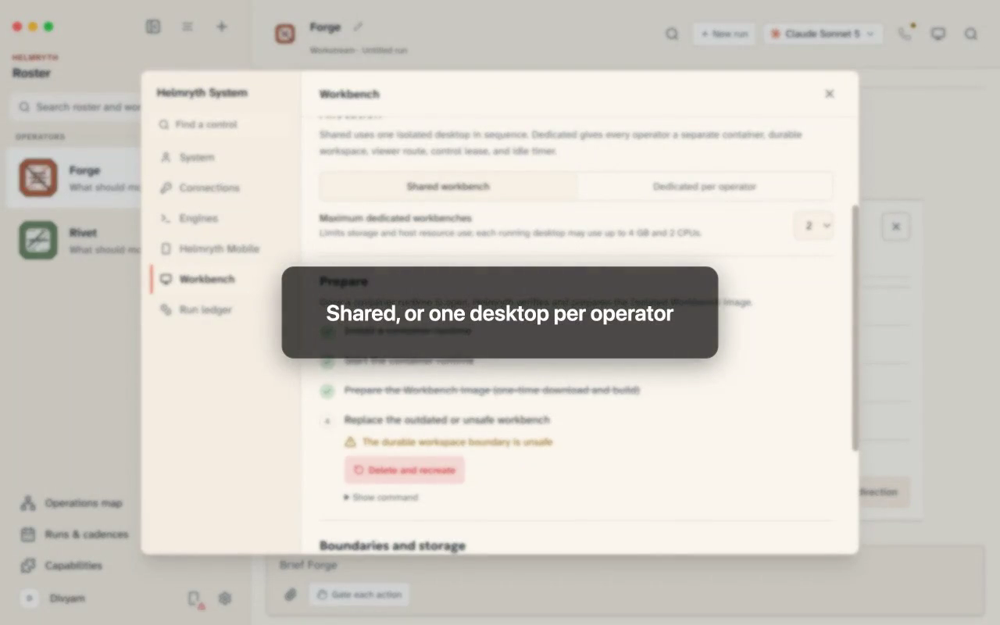
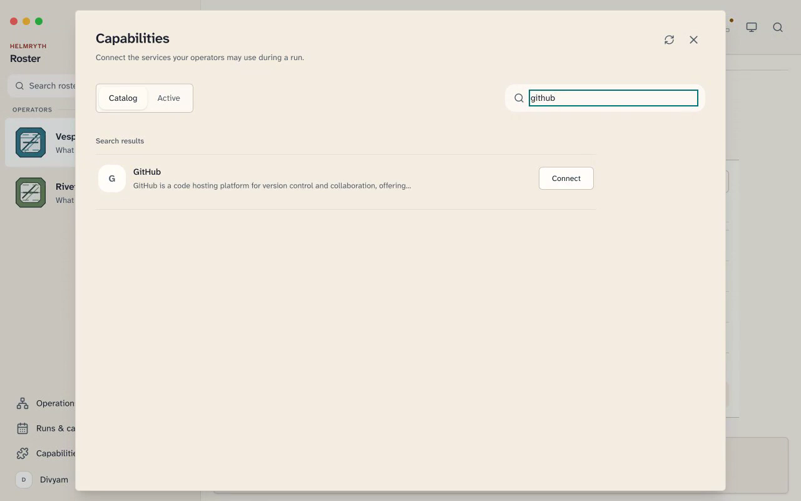
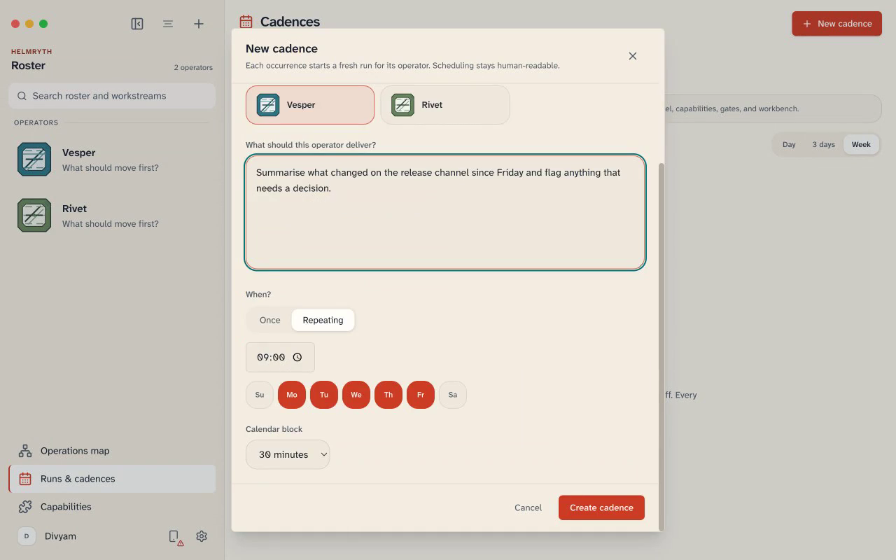
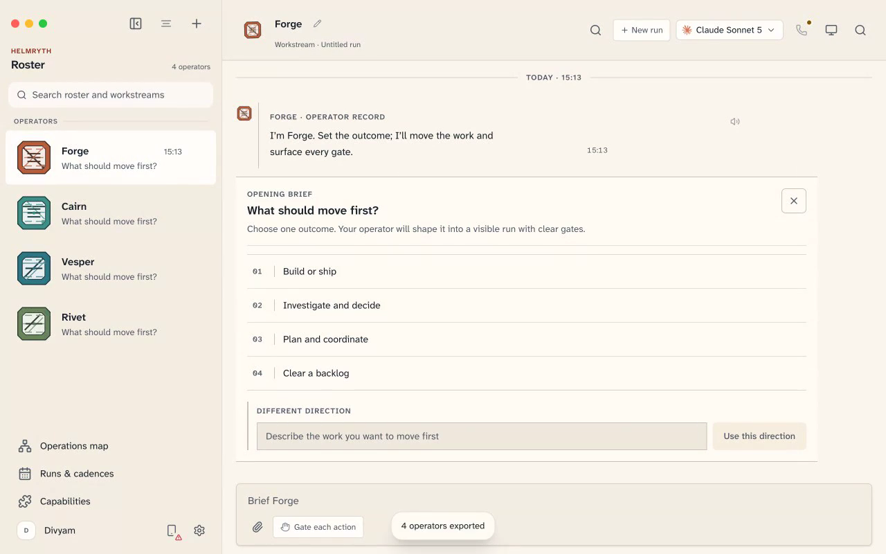
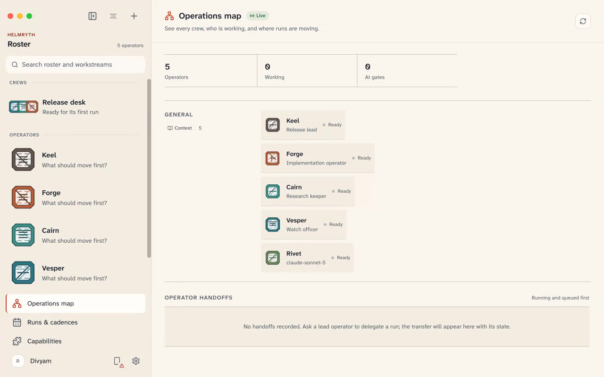
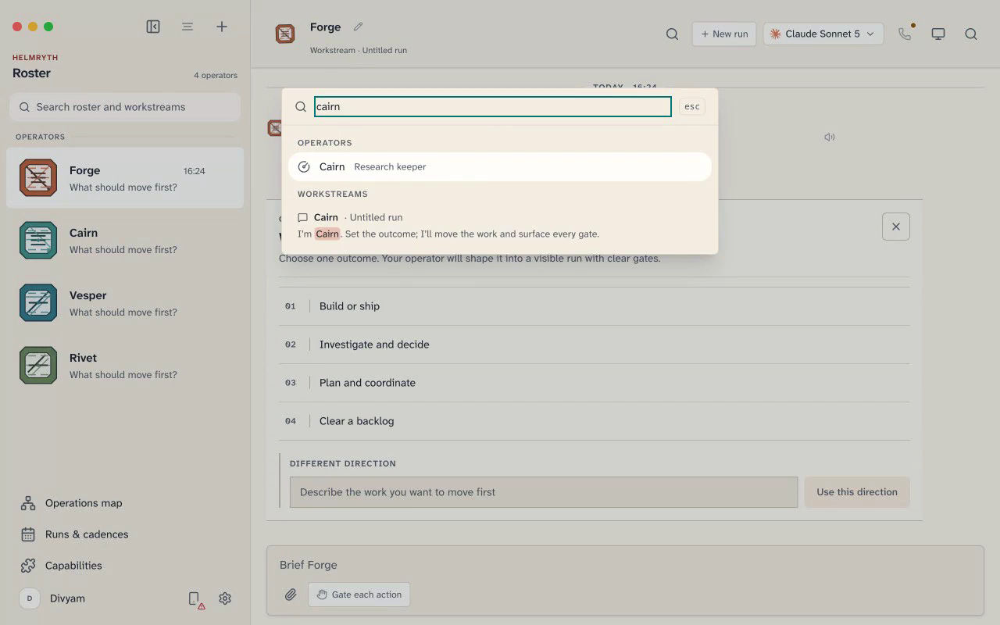

<div align="center">

# Helmryth

### The work moves. You hold the helm.

**A private operating system for autonomous work.**

Persistent operators that run on CLIs you already own. Crews that share a brief without sharing state.
A gate in front of every consequential action. All of it on your machine.

[Quick start](#quick-start) · [The ten films](#the-ten-films) · [How it works](#how-it-works) · [Configuration](#configuration) · [Security](#security-posture)

<sub>**2,915** tests green · **160** routes · **533/596** UI controls driven in a real browser · **0** axe WCAG 2.2 AA violations across six views · connector catalog fetched **live**</sub>

</div>

---

## Why this exists

A chat window is stateless. You paste context in, you copy an answer out, and when you close the
tab the thing you were working with is gone — its memory, its permissions, its half-finished job.

Helmryth keeps the other half. An **operator** is a standing role: its own engine, its own remit, its
own capabilities, its own workstreams and its own cost ledger, all of which survive a restart. A
**crew** is several operators sharing one brief and one transcript. A **gate** is the moment an
operator wants to do something consequential and has to ask you first — in the transcript, with the
exact command, and a record of what you decided.

Nothing here calls home. The control plane is a local HTTP server bound to IPv4 loopback, the
renderer is one known origin, your API keys are write-only, and telemetry is off unless you turn it
on.

---

## The ten films

Every film below was **recorded in one take against a live build** — real engines, real model
replies, real containers, real connectors. Nothing is mocked or re-enacted. Some films are played
back up to 1.2x to trim dead air while a model was thinking; the token counts, dollar amounts and
error states on screen are the ones the app actually produced.

> Each poster below links to its film. Click to play.
>
> <sub>Once this repo is pushed, drag the files from `docs/media/` into a GitHub issue and swap the
> resulting `user-attachments` URLs into `<video>` tags if you want them playing inline on the page —
> GitHub strips `<video>` when the `src` is a repo-relative path.</sub>

### 01 · From zero to a real answer

Cold profile to a working operator: identity, the live engine inventory, your first run — and a
transcript that keeps its own record, with token and cost accounting in the header.

[](docs/media/01-first-run.mp4)

<sub>▶︎ Click to play · <a href="docs/media/01-first-run.mp4">01-first-run.mp4</a></sub>

> **What to watch for:** the setup step titled *Runtime inventory — choose how work moves* is not a
> configuration form. It is a live scan of the CLIs already installed on the machine, with their real
> version numbers, and an install command for the ones that are missing.

### 02 · Operators, not chat tabs

A roster of standing roles. Each carries a sigil, a remit, its own engine, and its own workstreams.
Rename in place, archive without losing the record, restore it whole.

[](docs/media/02-operators.mp4)

<sub>▶︎ Click to play · <a href="docs/media/02-operators.mp4">02-operators.mp4</a></sub>

### 03 · Crews that actually coordinate

Assemble a team, give it one brief, and choose how work routes through it — the whole crew, a lead
operator, or only the operators you name. Then stop a run mid-sentence and watch it actually stop.

[](docs/media/03-crews.mp4)

<sub>▶︎ Click to play · <a href="docs/media/03-crews.mp4">03-crews.mp4</a></sub>

### 04 · Nothing consequential happens unasked

The one to watch if you only watch one. An operator wants to run a shell command; it does not get
to. A gate card appears in the transcript naming the **exact command**, the **consequence in plain
English**, and **who asked**. You answer. The answer is written to a decision ledger.

[](docs/media/04-gates.mp4)

<sub>▶︎ Click to play · <a href="docs/media/04-gates.mp4">04-gates.mp4</a></sub>

> **Verified, not staged:** the decision in that film is a real row —
> `Forge · Bash · mkdir -p /tmp/helmryth-demo && printf 'READY' > …` — readable at
> `GET /api/decisions` after the recording stopped.

### 05 · A real desktop, safely boxed

An isolated container per operator, or one shared desktop used in sequence. Watch the work happen
live, and take the controls back whenever you want — the control lease means you and the operator
are never fighting over the mouse.

[](docs/media/05-workbench.mp4)

<sub>▶︎ Click to play · <a href="docs/media/05-workbench.mp4">05-workbench.mp4</a></sub>

### 06 · Hundreds of real capabilities

Gmail, GitHub, Slack, Notion, Google Calendar and hundreds more, fetched live from the capability
broker rather than bundled (the app requests the catalog with a 500-row page size; a small offline
set ships as a fallback). Connecting one is an explicit, named act, and MCP credentials are written
to a `0600` temp file and passed by path — anything on argv is readable by any local process
through `ps` for the life of the turn.

[](docs/media/06-capabilities.mp4)

<sub>▶︎ Click to play · <a href="docs/media/06-capabilities.mp4">06-capabilities.mp4</a></sub>

### 07 · Work that starts without you

A cadence is a schedule that starts a fresh run with the operator's own model, capabilities, gates
and workbench. A webhook is the same thing triggered by an event instead of a clock.

[](docs/media/07-cadences.mp4)

<sub>▶︎ Click to play · <a href="docs/media/07-cadences.mp4">07-cadences.mp4</a></sub>

### 08 · Hand someone a whole team

Export the roster you have as one portable package, or load a complete crew from the library and
have it arrive whole. Every import is a transaction, so you can take the entire thing back in one
click.

[](docs/media/08-packages.mp4)

<sub>▶︎ Click to play · <a href="docs/media/08-packages.mp4">08-packages.mp4</a></sub>

### 09 · See the whole operation

Every operator, every crew, every handoff between them, and the context they share — in one frame.

[](docs/media/09-opsmap.mp4)

<sub>▶︎ Click to play · <a href="docs/media/09-opsmap.mp4">09-opsmap.mp4</a></sub>

### 10 · Keyboard-first, private by construction

`⌘K` from anywhere. The entire app without a mouse. Keys that are write-only by design — the app can
tell you a key is configured, and can never show it to you again. Telemetry off by default.

[](docs/media/10-keyboard.mp4)

<sub>▶︎ Click to play · <a href="docs/media/10-keyboard.mp4">10-keyboard.mp4</a></sub>

---

## Quick start

### Requirements

| | |
|---|---|
| **Node.js** | 24 or newer (`engines.node: ">=24"`) |
| **pnpm** | 10.33.0 (`packageManager`) |
| **An operator CLI** | at least one of Claude, Codex, OpenCode, Grok, Cursor, Qwen, Kimi, Droid… |
| **Docker** | optional — only for the Isolated Workbench |

Helmryth does not ship a model. It drives the CLIs you already own and are already signed in to,
which is why the setup step is a *scan* rather than a form.

### Run it from source

```bash
pnpm install

# terminal 1 — the local control plane (defaults to :8799, webhooks on :8800)
pnpm dev:server

# terminal 2 — the renderer (defaults to :5199)
pnpm dev

# terminal 3 — the desktop shell
pnpm dev:desktop
```

Then open the desktop window and walk the four setup steps. That is the whole install.

> **One thing that will bite you.** The core accepts requests from exactly one renderer origin. If
> you change the UI port, set the *same* `HELMRYTH_UI_ORIGIN` in all three terminals or the core will
> answer `403 forbidden: cross-origin request`. This is deliberate — it is what stops a web page you
> visit from driving your operators. See
> [Local control-plane request boundary](docs/local-control-plane-security.md).

### Verify your install

```bash
pnpm test          # full suite
pnpm lint          # oxlint
pnpm check:electron  # desktop hardening assertions
```

---

## How it works

```
┌──────────────────────────────────────────────────────────────┐
│  Electron shell        nodeIntegration off · contextIsolation │
│                        on · sandbox on · contextBridge only   │
├──────────────────────────────────────────────────────────────┤
│  React renderer        one known origin, e.g. :5199           │
├──────────────────────────────────────────────────────────────┤
│  Local core  :8799     IPv4 loopback only · exact-origin gate │
│    ├── engine drivers  claude · codex · opencode · openai…    │
│    ├── permission broker   unix socket, per turn, fail-closed │
│    ├── capability broker   500 connectors, credentials held   │
│    ├── cadence scheduler   + webhook receiver on :8800        │
│    └── SQLite + JSON       ~/.helmryth                        │
└──────────────────────────────────────────────────────────────┘
```

**The permission broker is the interesting part.** When an operator's engine wants a tool that its
permission mode would otherwise silently deny, the request is routed over a per-turn unix socket to
Helmryth, which renders it as a card in the transcript and waits for you. If the broker cannot start,
the turn **fails closed** — an unanswerable request is denied, never auto-approved.

---

## Configuration

Everything is optional. Helmryth runs with no configuration at all.

| Variable | Default | What it does |
|---|---|---|
| `HELMRYTH_PORT` | `8799` | Core HTTP port |
| `HELMRYTH_WEBHOOK_PORT` | `HELMRYTH_PORT + 1` | Webhook receiver |
| `HELMRYTH_UI_PORT` / `HELMRYTH_UI_ORIGIN` | `5199` | The one renderer origin the core will accept |
| `HELMRYTH_DATA_DIR` | `~/.helmryth` | Profile, transcripts, decision ledger |
| `COMPOSIO_API_KEY` | — | Enables the 500-connector capability catalog |
| `OPENAI_COMPAT_API_KEY` | — | Key for any OpenAI-compatible endpoint (OpenRouter, Groq, local) |
| `OPENAI_COMPAT_URL` · `OPENAI_COMPAT_MODEL` · `OPENAI_COMPAT_PROVIDER` | — | Endpoint, model and provider preference for that key |
| `HELMRYTH_OPENAI_IMAGE_KEY` | — | Image generation for operator sigils |

In packaged builds, credentials go through Electron's `safeStorage` into the OS keychain. In every
build they are **write-only across the API**: `GET /api/config` returns *configured* flags, never
values.

---

## Security posture

This is a local agent runner that executes real commands on your machine. The boundaries are
deliberate and tested, not aspirational.

- **Exact-authority origin gate.** A request carrying a *wrong* `Origin` is refused, and `localhost`
  is not accepted as an alias for `127.0.0.1` — which is what closes DNS rebinding, since a browser
  always sends `Origin` cross-origin. A request with no `Origin` at all (curl, a native client) is
  still served, so the boundary is the loopback bind plus the origin check, not the origin check
  alone.
- **Desktop hardening.** `nodeIntegration: false`, `contextIsolation: true`, `sandbox: true`, all IPC
  through a `contextBridge` allowlist. External URLs open only if the scheme is `http:` or `https:` —
  an allowlist, not a denylist, so `javascript:`, `file://`, `data:`, `chrome://` and every scheme
  nobody has thought of yet are refused by default
  (`electron/external-url.mjs`).
- **Gates fail closed.** A permission broker that cannot bind denies; it never degrades to allow.
- **Write-only secrets.** Keys go in and never come back out over HTTP.
- **Telemetry off by default,** and there is no sink configured in this tree.
- **Webhook secrets are show-once.** The creating `POST` returns the credential so you can install
  it; `GET /api/webhooks` has no secret field at all, so listing endpoints can never re-reveal one.

### Verified surface

These are counted by `scripts/check-qa-coverage.mjs`, which fails the build if the code drifts from
the documented census:

| | |
|---|---|
| Tests passing | **2,915** across 272 files (+ 47 control-plane, 15 broker) |
| HTTP routes | **160** unique, all contract-tested |
| Renderer controls | **596** declared across 63 files; **533** exercised in a live browser |
| Runtime IPC channels | **76**, plus 10 preload event topics |
| Accessibility | **0** violations from axe-core (wcag2a/2aa/21a/21aa/22aa) on six views: workstream, operations map, cadences, capabilities, system settings, operator profile |

The 63 controls not exercised in a browser are individually accounted for: Linux-only components,
Electron-only bridges, or states that need a live voice call. That list is in
[`docs/qa/`](docs/qa/), along with the full traceability matrix.

---

## What ships in this repo

- the desktop app and the local control-plane server
- the companion sidecar for phones
- the Cloudflare workers for the capability broker and control plane
- docs, QA traceability, and packaging metadata

Packaged distribution endpoints are **not** provisioned here. If you publish Helmryth for others,
configure your own release channel, signing assets and checksums.

## Documentation

- Installation
- Quick tour
- Product surfaces
- Capabilities
- Workbench environments
- [Local control-plane request boundary](docs/local-control-plane-security.md)

## Legal and provenance

Attribution and third-party notices live in [NOTICE](NOTICE) and [third_party/](third_party/).
Those records preserve upstream history and licensing; they are not marketing copy.

<div align="center">
<br>
<sub><b>HELMRYTH</b> · The work moves. You hold the helm.</sub>
</div>
