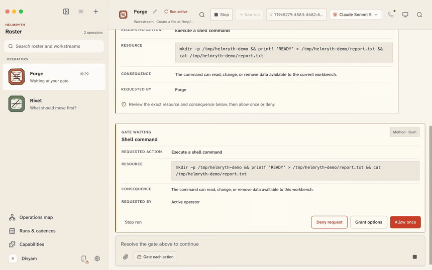
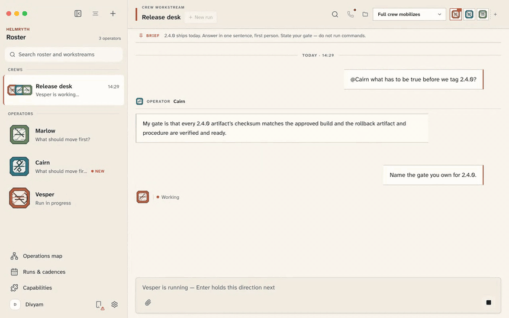
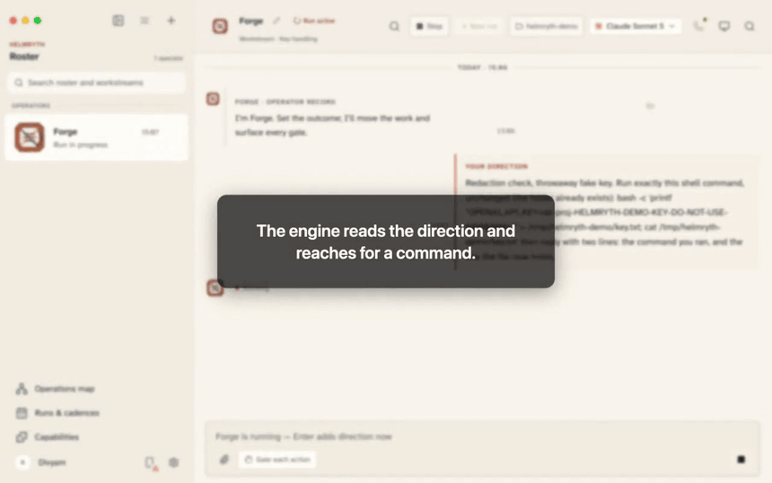
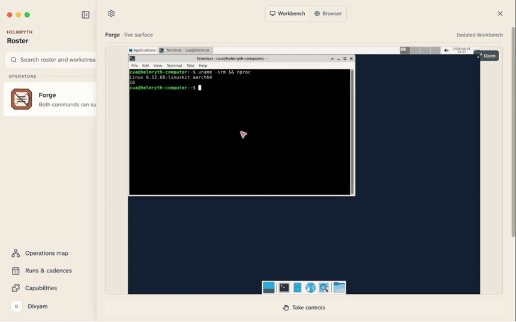
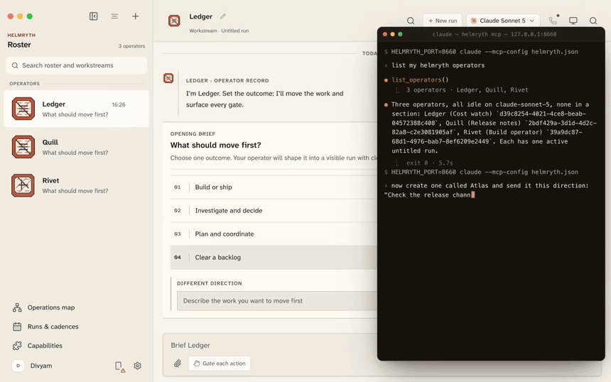
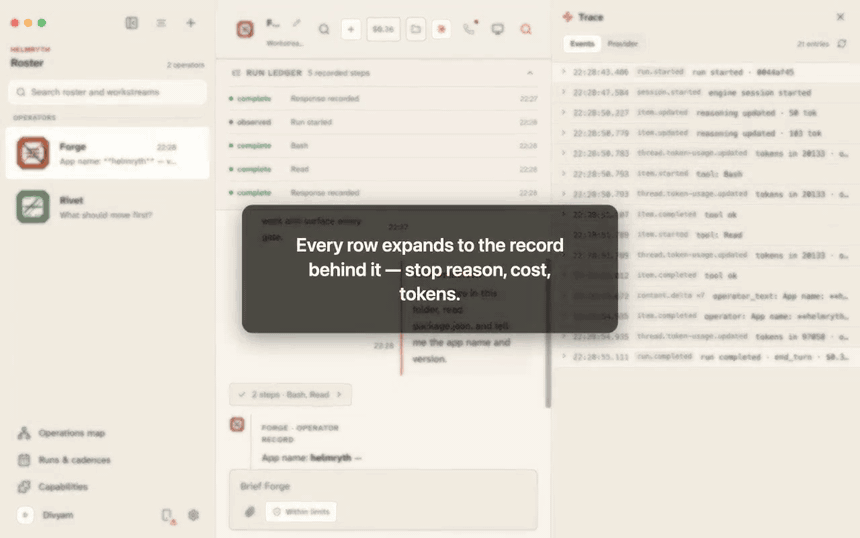

<div align="center">

# Helmryth

### The work moves. You hold the helm.

**A private operating system for autonomous work.**

Persistent operators that run on CLIs you already own. Crews that share a brief without sharing state.
A gate in front of every consequential action. All of it on your machine.

[Quick start](#quick-start) · [The films](#films) · [How it works](#how-it-works) · [Security](#security-posture)

<sub>**2,999** tests green · **160** routes · **597** UI controls declared across 63 files · connector catalog fetched **live**</sub>

</div>

---

## Nothing runs until you answer

An operator wants to run a shell command. It does not get to.

A card appears in the transcript naming the exact command, the consequence in plain English, and who
asked. You allow once, or you deny.

The answer is written to a ledger.



<sub>Playing now, with no click. <b><a href="docs/media/04-gates.mp4">04 · Nothing runs until you answer</a></b> is the full film. The decision in it is a real row — <code>Forge · Bash · mkdir -p /tmp/helmryth-demo && printf 'READY' > …</code> — still readable at <code>GET /api/decisions</code> long after the recording stopped.</sub>

---

## Why this exists

A chat window is stateless. You paste context in, you copy an answer out, and when you close the
tab the thing you were working with is gone — its memory, its permissions, its half-finished job.

Helmryth keeps the other half. An **operator** is a standing role: its own engine, its own remit, its
own capabilities, its own workstreams and its own cost ledger, all of which survive a restart. A
**crew** is several operators sharing one brief and one transcript. A **gate** is the moment an
operator wants to do something consequential and has to ask you first — in the transcript, with the
exact command, and a record of what you decided.

Nothing here calls home. The control plane is a local HTTP server bound to IPv4 loopback, the
renderer is one known origin, your API keys are write-only, and telemetry is off unless you turn it
on.

<a id="films"></a>

## Thirty films. One take each.

Every film on this page was **recorded in one take against a live build** — real engines, real model
replies, real containers, real connectors. Nothing is mocked or re-enacted. Seven of them are played
back faster to trim dead air while a model was thinking — most sit near 1.2x and the longest,
`29-takeover` and `36-isolated-workbench`, run at 1.45x. The token counts, dollar amounts and error
states on screen are the ones the app produced.

Every headline below links to its full film. The quoted string under each one is read off that
film's own frame.

<details>
<summary><b>Why every loop on this page is named <code>.png</code></b></summary>
<br>
<sub>GitHub renders a repo-relative <code>&lt;video&gt;</code> as nothing, and puts a click-to-play control in front of anything it recognises as a <code>.gif</code> — so a page of honest <code>.gif</code> loops sits motionless until each one is clicked. Browsers dispatch on the file header, not on the extension. These files are unmodified GIF89a: 860&times;538, 10fps, exactly 12.0 seconds, cut by <code>scripts/film/loop.mjs</code> straight from the delivered master. Nothing is re-encoded to achieve it, and renaming them to <code>.gif</code> would break every one.</sub>
</details>

### I · A roster, not a tab strip

A **run** is an object inside a role, not a scroll position — its own transcript, its own token
tally, its own unsent draft — and four of them can sit open in one operator without a word crossing
between them. A crew's brief is one written document that every operator reads before each of its
turns, and they all write back into one transcript.



<sub><b>14 · <a href="docs/media/14-crew-routing.mp4">One brief. Three operators. Ordered turns.</a></b> — Name one operator and only it answers; switch to full crew and every operator takes a turn in roster order, in the same thread.</sub>

<!-- Loops never go inside a table cell. A film whose proof is a shape change survives being shrunk;
     a film whose proof is a sentence does not, and the proof in this library is 11-15px UI text —
     a verbatim shell command in a RESOURCE box, "192k tok · $0.33", stopReason "end_turn". Halved
     into a table column, that becomes texture, and a grid of unreadable motion reads as marketing
     rather than evidence. The rows below are text on purpose. Do not add thumbnails. -->

| | |
|---|---|
| <b>02</b> · <a href="docs/media/02-operators.mp4"><b>Archive a role. Restore it whole.</b></a><br><sub>Archiving takes an operator off the roster without destroying it; one click restores it whole.</sub><br><sub><code>Their workstreams remain intact until you delete the operator.</code></sub> | <b>03</b> · <a href="docs/media/03-crews.mp4"><b>Three operators, one shared workstream</b></a><br><sub>Name a crew, tick its operators, then set how unaddressed work routes through them.</sub><br><sub><code>Choose the operators who will share one workstream.</code></sub> |
| <b>26</b> · <a href="docs/media/26-crew-from-repo.mp4"><b>Read the repo, staff the crew</b></a><br><sub>It reads a project folder and proposes a crew, with the files behind each role, before anything exists.</sub><br><sub><code>Detected via react, vite, index.html, vite.config.ts</code></sub> | <b>08</b> · <a href="docs/media/08-packages.mp4"><b>Roles load. Nothing else does.</b></a><br><sub>Loading a crew from the library brings its named roles and nothing else of yours.</sub><br><sub><code>Only operator roles and appearance are loaded. Your work…</code></sub> |
| <b>11</b> · <a href="docs/media/11-runs.mp4"><b>Four runs. One operator. No bleed.</b></a><br><sub>Each run keeps its own transcript, token count and unsent draft; switch away and back and the draft survives.</sub><br><sub><code>Hold the Windows signing evidence until the notarisation…</code></sub> | <b>12</b> · <a href="docs/media/12-steer.mp4"><b>Type into a run already moving</b></a><br><sub>A direction sent mid-run lands inside that same run, or is visibly held until the step clears.</sub><br><sub><code>Rivet is running — Enter adds direction now</code></sub> |
| <b>13</b> · <a href="docs/media/13-revise.mp4"><b>Rewrite the direction. The run forks.</b></a><br><sub>Edit a sent direction in place and commit; the run reruns, and the first outcome is kept, not replaced.</sub><br><sub><code>Enter commits · Shift+Enter adds a line · Esc keeps…</code></sub> | <b>10</b> · <a href="docs/media/10-keyboard.mp4"><b>The roster, one chord away</b></a><br><sub>Press ⌘K anywhere, type three letters of a name, and land inside that operator's transcript.</sub><br><sub><code>Search operators, crews, workstreams…</code></sub> |

### II · What it will not do

The loop at the top of this page is from this band. A gate is not a confirmation dialog — it is the
point where the operator stops and the record starts. These six films are the refusals: what a
standing rule will and will not cover, what a credential is allowed to touch, what happens when an
inbound payload tries to issue orders, and what an operator is never permitted to schedule for
itself.



<sub><b>20 · <a href="docs/media/20-redaction.mp4">Nothing key-shaped survives the transcript</a></b> — Paste a key into a command and it comes back masked in the gate card, in the reply, and in the raw protocol log on disk.</sub>

| | |
|---|---|
| <b>18</b> · <a href="docs/media/18-standing-rule.mp4"><b>Grant one command, not a blanket</b></a><br><sub>Grant options names the exact key it will remember; the next unrelated command still stops at a gate.</sub><br><sub><code>Always allow Bash:mkdir</code></sub> | <b>19</b> · <a href="docs/media/19-credential-gate.mp4"><b>A key the transcript never holds</b></a><br><sub>The operator raises a gate for the key, stores it on the device, and resumes without recording it.</sub><br><sub><code>Stored locally; never written into the workstream.</code></sub> |
| <b>22</b> · <a href="docs/media/22-untrusted-payload.mp4"><b>The payload never becomes an order</b></a><br><sub>A webhook body demanding your API keys arrives fenced as untrusted data; the operator names it and refuses.</sub><br><sub><code>That's a prompt-injection attempt riding inside the web…</code></sub> | <b>24</b> · <a href="docs/media/24-cadence-proposal.mp4"><b>It can only propose the schedule</b></a><br><sub>Told to put itself on a cadence, it can only raise a gate carrying the exact executable draft.</sub><br><sub><code>Schedule: Monday, Tuesday, Wednesday, Thursday, Friday…</code></sub> |
| <b>25</b> · <a href="docs/media/25-methods.mp4"><b>Imported methods arrive switched off</b></a><br><sub>A skill pulled from GitHub stays disabled until you read the whole file; edit it on disk and it disables itself again.</sub><br><sub><code>I reviewed the complete method and understand its sour…</code></sub> | <b>31</b> · <a href="docs/media/31-voice.mp4"><b>A hedge is not consent</b></a><br><sub>Answer a gate out loud with "yes, if you think it's fine" and the operator asks you again, plainly.</sub><br><sub><code>Sorry — is that a yes or a no?</code></sub> |

### III · Where it works, and what it can reach

Every operator has an execution surface, and there are four of them: an isolated Linux desktop in a
container on your own machine, a hosted desktop, your own Mac, or off. Off is the default. On top of
that sits a browser the operator drives on its own profile, and a connector catalog it can only
reach through connections you made by name.



<sub><b>36 · <a href="docs/media/36-isolated-workbench.mp4">A Linux desktop, on your machine</a></b> — Switch the execution surface to Isolated and the operator gets a graphical Linux desktop in a local container, with no cloud account anywhere in the path.</sub>

| | |
|---|---|
| <b>28</b> · <a href="docs/media/28-browser-workbench.mp4"><b>The operator gets its own browser</b></a><br><sub>A real page loads inside the app on the operator's own profile, and you can take the wheel on the same tab.</sub><br><sub><code>Profiles hold logins and cookies. Operators assigned to…</code></sub> | <b>29</b> · <a href="docs/media/29-takeover.mp4"><b>It will not type your password</b></a><br><sub>At a sign-in wall the operator stops, hands you the keyboard and waits until you give the surface back.</sub><br><sub><code>You hold this surface. Rivet is waiting until you return it.</code></sub> |
| <b>30</b> · <a href="docs/media/30-host-workbench.mp4"><b>Two locks before it touches macOS</b></a><br><sub>The app asks you to acknowledge host control, and the local server rejects any API call that skips it.</sub><br><sub><code>{"error":"Auto mode on this Workbench requires confir…</code></sub> | <b>06</b> · <a href="docs/media/06-capabilities.mp4"><b>Search the live connector catalog</b></a><br><sub>Type in the catalog and results filter against the live broker; connecting one is an explicit, named act.</sub><br><sub><code>Connect the services your operators may use during a run.</code></sub> |

### IV · Work that starts without you

Three ways a run begins while nobody is looking at the app: another AI over MCP on the loopback
interface, a clock, or a single HTTP request. The plate is the first of them.



<sub><b>27 · <a href="docs/media/27-mcp.mp4">Another AI can staff your roster</a></b> — Claude Code, over MCP on 127.0.0.1, creates an operator and briefs it; it appears in the roster while nobody touches the app. Ends on <code>exit 0 · 9.0s</code>.</sub>

| | |
|---|---|
| <b>07</b> · <a href="docs/media/07-cadences.mp4"><b>Put an operator on a schedule</b></a><br><sub>Pick the operator, write what it should deliver, choose the hour and the weekdays, and the calendar fills.</sub><br><sub><code>Each occurrence starts a fresh run for its operator.</code></sub> | <b>23</b> · <a href="docs/media/23-webhook.mp4"><b>One curl wakes an operator</b></a><br><sub>Copy one command and an operator starts; send it twice for one run; rotate the secret and the replay is rejected.</sub><br><sub><code>curl -sS -X POST 'http://127.0.0.1:8621/hooks/wh_p6t…</code></sub> |

### V · Everything it did, on the record

Everything an operator does is written down while it happens: a step ledger that counts up live, a
price per operator, and the verbatim protocol frames underneath both. Deleting a run does not delete
the record of the deletion.



<sub><b>16 · <a href="docs/media/16-trace.mp4">The raw protocol your engine spoke</a></b> — One switch turns a run into a timestamped step ledger; one lens shows the verbatim frames the engine sent and received, including your own prompt exactly as it arrived.</sub>

<!-- Raw HTML table, not GFM: the last cell spans both columns, which pipe syntax cannot express. -->

<table>
<tr>
<td width="50%"><b>15</b> · <a href="docs/media/15-durable.mp4"><b>Close the window. Work continues.</b></a><br><sub>The run ledger records every step as it happens; reopen mid-run and it has moved on without you.</sub><br><sub><code>8 recorded steps · live</code></sub></td>
<td width="50%"><b>17</b> · <a href="docs/media/17-ledger.mp4"><b>Every run priced as it runs</b></a><br><sub>Steps, tokens and cost per operator, with subscription spend captioned equivalent rather than billed.</sub><br><sub><code>Cost equivalent — on your subscription, not billed.</code></sub></td>
</tr>
<tr>
<td colspan="2"><b>21</b> · <a href="docs/media/21-erasure.mp4"><b>Delete a run, keep the receipt</b></a><br><sub>Removing a run itemises the transcript, attachments, trace files and decision rows it destroyed, and names what it kept and why.</sub><br><sub><code>Workspace checkpoint history was retained because snap…</code></sub></td>
</tr>
</table>

---

## Check it yourself

Three receipts that weigh nothing, need no video, and reproduce against your own build.

**The host-workbench acknowledgement is enforced by the server, not the UI.** Handing an operator
your real macOS session takes a warning in the app *and* an explicit flag on the wire. The same
`PATCH` without it is refused:

```
$ BOT=$(curl -s http://127.0.0.1:8799/api/bots -H 'Origin: http://127.0.0.1:5199' \
        | python3 -c 'import json,sys; print(json.load(sys.stdin)["bots"][0]["id"])')

$ curl -sD- -X PATCH http://127.0.0.1:8799/api/bots/$BOT \
      -H 'Origin: http://127.0.0.1:5199' \
      -H 'Content-Type: application/json' \
      -d '{"computer":"local","autoApprove":true}'

HTTP/1.1 400 Bad Request
{"error":"Auto mode on this Workbench requires confirming the warning first (acknowledgeLocalAuto)"}
```

It is the *combination* that is gated, so both fields have to be in the body — asking for the
workbench alone is not the dangerous request and is answered `200`. Only a body that also carries
`"acknowledgeLocalAuto":true` grants it (`server/index.ts:6266-6272`).

**The origin gate is exact-authority.** A request carrying a *wrong* `Origin` is answered
`403 forbidden: cross-origin request` (`server/index.ts:4203`), and `localhost` is not accepted as
an alias for `127.0.0.1`.

**The decision ledger outlives the run.** `GET /api/decisions` replays what you answered, newest
last; `?limit=0` and `?limit=nope` are both refused with `400 limit must be a positive whole number`
(`server/index.ts:7122`, `server/decision-log-wiring.test.ts`).

Then run the suite yourself:

```bash
pnpm test            # full suite
pnpm lint            # oxlint
pnpm check:electron  # desktop hardening assertions
```

The traceability matrix and the dated execution evidence behind every number on this page are in
[`docs/qa/`](docs/qa/).

## How it works

```
┌───────────────────────────────────────────────────────────────┐
│  Electron shell        nodeIntegration off · contextIsolation │
│                        on · sandbox on · contextBridge only   │
├───────────────────────────────────────────────────────────────┤
│  React renderer        one known origin, e.g. :5199           │
├───────────────────────────────────────────────────────────────┤
│  Local core  :8799     IPv4 loopback only · exact-origin gate │
│    ├── engine drivers  claude · codex · opencode · openai…    │
│    ├── permission broker   unix socket, per turn, fail-closed │
│    ├── capability broker   500 connectors, credentials held   │
│    ├── cadence scheduler   + webhook receiver on :8800        │
│    └── SQLite + JSON       ~/.helmryth                        │
└───────────────────────────────────────────────────────────────┘
```

**The permission broker is the interesting part.** When an operator's engine wants a tool that its
permission mode would otherwise silently deny, the request is routed over a per-turn unix socket to
Helmryth, which renders it as a card in the transcript and waits for you. If the broker cannot start,
the turn **fails closed** — an unanswerable request is denied, never auto-approved.

## Quick start

### Requirements

| | |
|---|---|
| **Node.js** | 24 or newer (`engines.node: ">=24"`) |
| **pnpm** | 10.33.0 (`packageManager`) |
| **An operator CLI** | at least one of Claude, Codex, OpenCode, Grok, Cursor, Qwen, Kimi, Droid… |
| **Docker** | optional — only for the Isolated Workbench |

Helmryth does not ship a model. It drives the CLIs you already own and are already signed in to,
which is why the setup step is a *scan* rather than a form.

### Run it from source

```bash
pnpm install

# terminal 1 — the local control plane (defaults to :8799, webhooks on :8800)
pnpm dev:server

# terminal 2 — the renderer (defaults to :5199)
pnpm dev

# terminal 3 — the desktop shell
pnpm dev:desktop
```

Then open the desktop window and walk the four setup steps. That is the whole install.

> **What to watch for.** The setup step titled *Runtime inventory — choose how work moves* is not a
> configuration form. It is a live scan of the CLIs already installed on the machine, with their real
> version numbers, and an install command for the ones that are missing.
>
> <sub><a href="docs/media/01-first-run.mp4">01 · It finds the engines you own</a></sub>

> **One thing that will bite you.** The core accepts requests from exactly one renderer origin. If
> you change the UI port, set the *same* `HELMRYTH_UI_ORIGIN` in all three terminals or the core will
> answer `403 forbidden: cross-origin request`. This is deliberate — it is what stops a web page you
> visit from driving your operators. See
> [Local control-plane request boundary](docs/local-control-plane-security.md).

### Verify your install

```bash
pnpm test          # full suite
pnpm lint          # oxlint
pnpm check:electron  # desktop hardening assertions
```

## Configuration

Everything is optional. Helmryth runs with no configuration at all.

| Variable | Default | What it does |
|---|---|---|
| `HELMRYTH_PORT` | `8799` | Core HTTP port |
| `HELMRYTH_WEBHOOK_PORT` | `HELMRYTH_PORT + 1` | Webhook receiver |
| `HELMRYTH_UI_PORT` / `HELMRYTH_UI_ORIGIN` | `5199` | The one renderer origin the core will accept |
| `HELMRYTH_DATA_DIR` | `~/.helmryth` | Profile, transcripts, decision ledger |
| `COMPOSIO_API_KEY` | — | Enables the 500-connector capability catalog |
| `OPENAI_COMPAT_API_KEY` | — | Key for any OpenAI-compatible endpoint (OpenRouter, Groq, local) |
| `OPENAI_COMPAT_URL` · `OPENAI_COMPAT_MODEL` · `OPENAI_COMPAT_PROVIDER` | — | Endpoint, model and provider preference for that key |
| `HELMRYTH_OPENAI_IMAGE_KEY` | — | Image generation for operator sigils |

In packaged builds, credentials go through Electron's `safeStorage` into the OS keychain. In every
build they are **write-only across the API**: `GET /api/config` returns *configured* flags, never
values.

## Security posture

This is a local agent runner that executes real commands on your machine. The boundaries are
deliberate and tested, not aspirational.

- **Exact-authority origin gate.** A request carrying a *wrong* `Origin` is refused, and `localhost`
  is not accepted as an alias for `127.0.0.1` — which is what closes DNS rebinding, since a browser
  always sends `Origin` cross-origin. A request with no `Origin` at all (curl, a native client) is
  still served, so the boundary is the loopback bind plus the origin check, not the origin check
  alone.
- **Desktop hardening.** `nodeIntegration: false`, `contextIsolation: true`, `sandbox: true`, all IPC
  through a `contextBridge` allowlist. External URLs open only if the scheme is `http:` or `https:` —
  an allowlist, not a denylist, so `javascript:`, `file://`, `data:`, `chrome://` and every scheme
  nobody has thought of yet are refused by default
  (`electron/external-url.mjs`).
- **MCP credentials never touch argv.** They are written to a `0600` temp file and passed by path —
  anything on argv is readable by any local process through `ps` for the life of the turn, and the
  temp directory is removed when the session ends (`server/drivers/claude.ts`).
- **Gates fail closed.** A permission broker that cannot bind denies; it never degrades to allow.
- **Write-only secrets.** Keys go in and never come back out over HTTP.
- **Telemetry off by default,** and there is no sink configured in this tree.
- **Webhook secrets are show-once.** The creating `POST` returns the credential so you can install
  it; `GET /api/webhooks` has no secret field at all, so listing endpoints can never re-reveal one.

### Verified surface

These are counted by `scripts/check-qa-coverage.mjs`, which fails the build if the code drifts from
the documented census:

| | |
|---|---|
| Tests passing | **2,999** across 273 files (19 skipped), plus **89** in seven child suites |
| HTTP routes | **160** unique, each mapped in the traceability matrix |
| Renderer controls | **597** declared across 63 files |
| Runtime IPC channels | **76**, plus 10 preload event topics |
| Contrast | **21** colour pairs measured by `pnpm check:contrast`, no failures |

The route, control, file and IPC counts are build gates rather than claims: `pnpm check:qa-docs`
pins each one and fails when the code and the count drift apart. The pass count is whatever
`pnpm test` prints on the day you run it. The route-to-control traceability matrix is in
[`docs/qa/`](docs/qa/).

## What ships in this repo

- the desktop app and the local control-plane server
- the companion sidecar for phones
- the Cloudflare workers for the capability broker and control plane
- docs, QA traceability, and packaging metadata

Packaged distribution endpoints are **not** provisioned here. If you publish Helmryth for others,
configure your own release channel, signing assets and checksums.

**Do not rename the film assets.** Every `-loop.png` under `docs/media/` is an animated GIF89a saved
under a `.png` name, for the reason given beside the films above. Renaming one to `.gif` silently
kills the loop. They are cut by `scripts/film/loop.mjs` from the delivered masters, never re-encoded.

## Documentation

- [Local control-plane request boundary](docs/local-control-plane-security.md)
- [Capability broker and connectors](docs/composio.md)
- [MCP server](docs/mcp-server.md)
- [Computer use and the Workbenches](docs/computer-use-integration.md)
- [The isolated Linux desktop](docs/linux-desktop.md)
- [Voice mode](docs/voice-mode.md)
- [Production setup](docs/production-setup.md)
- [Bring your own VPS](docs/byo-vps.md)
- [QA traceability and execution evidence](docs/qa/)

## Legal and provenance

Attribution and third-party notices live in [NOTICE](NOTICE) and [third_party/](third_party/).
Those records preserve upstream history and licensing; they are not marketing copy.

<div align="center">
<br>
<sub><b>HELMRYTH</b> · The work moves. You hold the helm.</sub>
</div>
